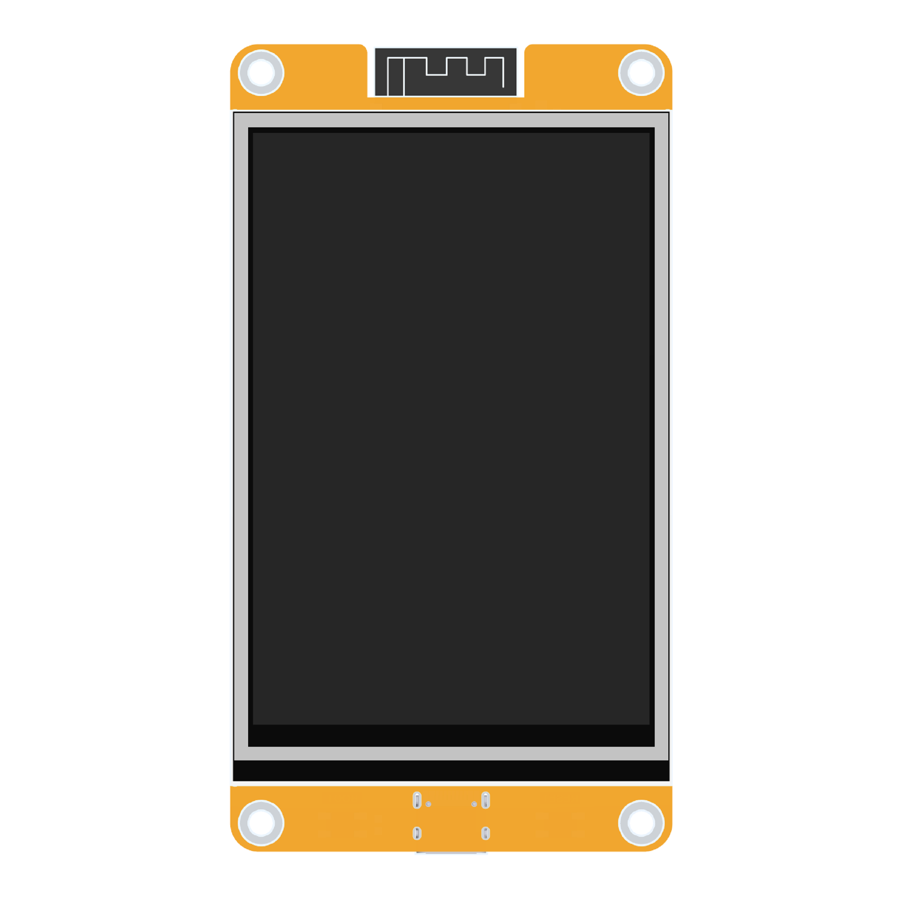
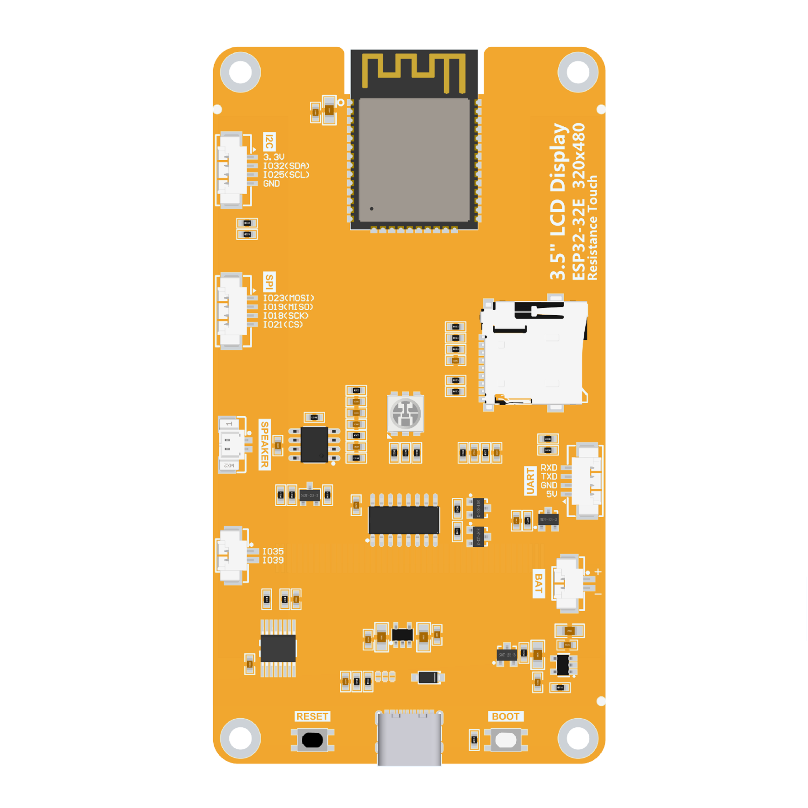
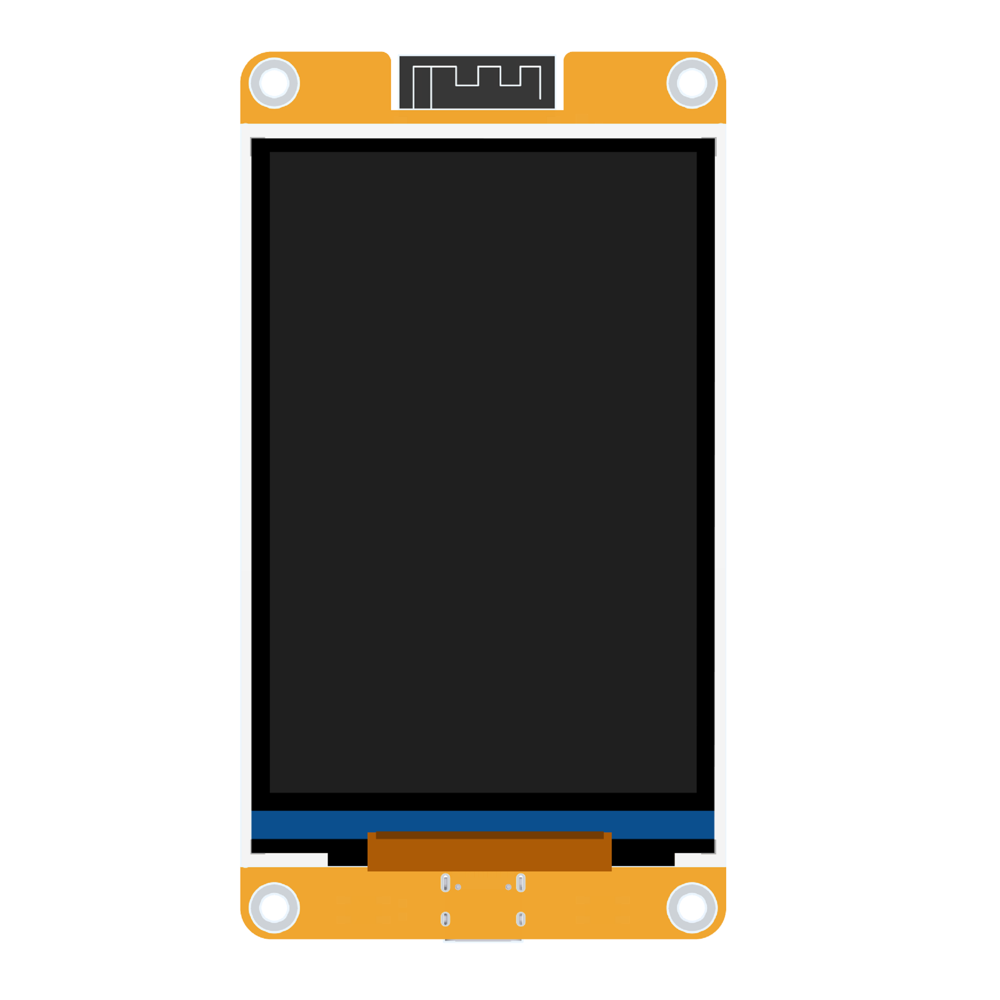
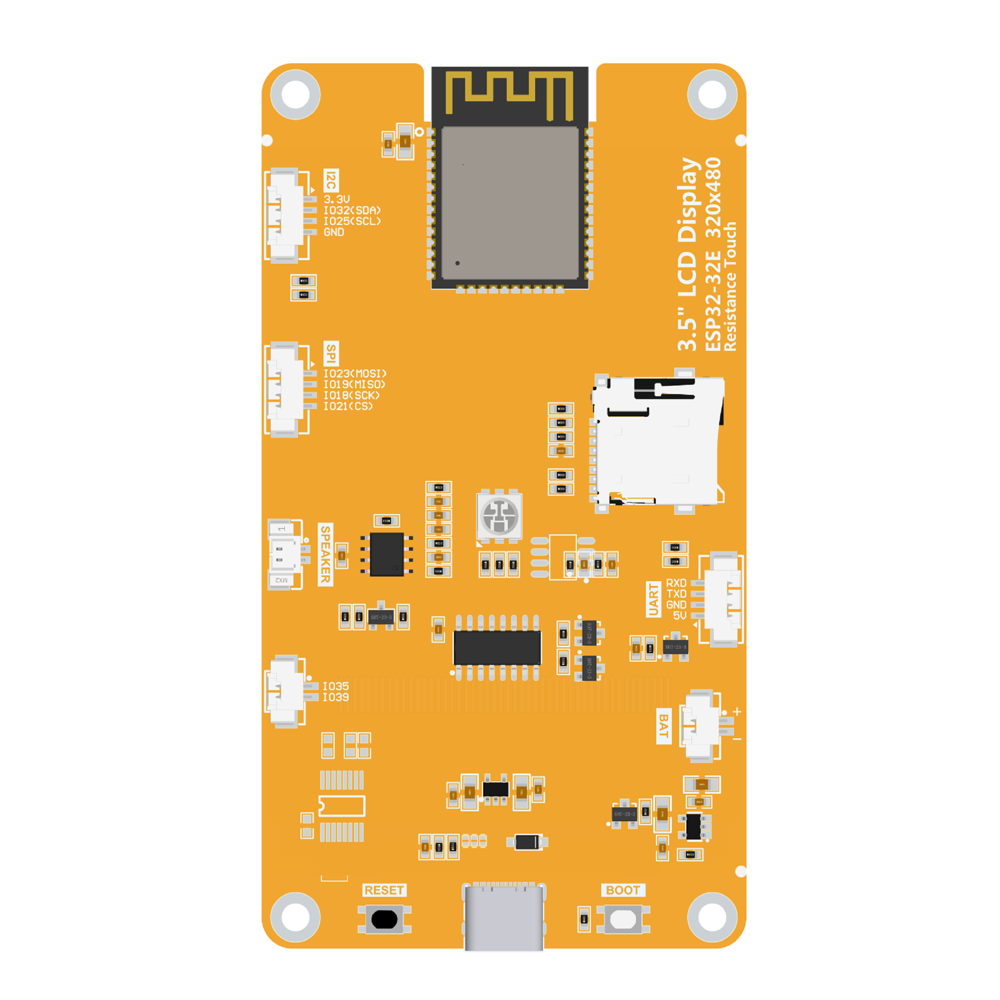

# 3.5inch ESP32-32E TFT 显示模组

# 产品图片

E32R35T-正面

E32R35T-背面

-   

E32N35T-正面

E32N35T--背面

# 产品介绍

-   自带ESP32-32E模组，开发方便，开发资源充足
-   3.5寸彩屏，320x480分辨率最，大支持262K色（RGB666），显示色彩丰富
-   接口丰富，方便连接各种外设（I2C、SPI、UART等外设）
-   支持外接喇叭，播放音频
-   自带RGB三色指示灯，指示状态丰富
-   自带电阻触摸屏，方便人机交互
-   标准的TYPE-C接口，方便程序下载和供电
-   自带micro TF卡槽，方便扩展存储
-   支持外接锂电池，轻巧便携
-   自带电池充电管理电路，可确保电池安全充放电
-   提供丰富的示例程序，方便学习
-   提供底层驱动技术支持,WIKI资料在线更新
-   模块老化测试多重检测可达军工级标准，支持长期稳定工作

