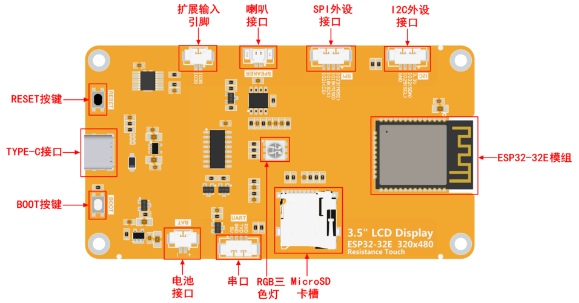

# 接口定义

## 接口功能说明

| **接口**          | **功能说明**                                                                                                                                                                                                |
|-------------------|-------------------------------------------------------------------------------------------------------------------------------------------------------------------------------------------------------------|
| **ESP32-32E模组** | 显示模块主控，控制板载外设和外接外设。                                                                                                                                                                      |
| **MicroSD卡槽**   | 插入Micro SD卡，用来扩展存储空间，例如存放字库、图片、音频文件等大数据内容。                                                                                                                                |
| **RGB三色灯**     | 包含红、绿、蓝三种颜色的LED灯，每种灯都可由IO控制，用来指示状态。                                                                                                                                           |
| **串口**          | 1.25mm 4P座子。可用于串口调试、下载以及通信。需外接USB转串口模块。                                                                                                                                          |
| **电池接口**      | 1.25mm 2P座子，用于接入3.7V聚合锂电池， 通过电池充电管理电路对电池进行充电，也可用于电池供电。 注意接口正、负极。                                                                                           |
| **BOOT按键**      | 用于进入下载模式或者按键测试。 按住此按键上电，然后松开可进入下载模式， 或者上电后，按住此按键，再按RESET键，松开RESET键后，再松开此按键，也可以进下载模式。 不需要进入下载模式时，此按键可做普通按键使用。 |
| **TYPE-C接口**    | 用于模块供电和下载程序。此接口和模块上的一键下载电路相连， 可实现自动进入下载模式（无需按BOOT键）。                                                                                                         |
| **RESET按键**     | 用于ESP32主控以及LCD复位，按下后电平复位。                                                                                                                                                                  |
| **扩展输入引脚**  | 1.25mm 2P座子。IO35和IO39两个只有输入功能的IO，用于接入输入信号。                                                                                                                                           |
| **喇叭接口**      | 1.25mm 2P座子。用于接入喇叭播放音频。                                                                                                                                                                       |
| **SPI外设接口**   | 1.25mm 4P座子。用于外接SPI通信设备，此SPI接口和MicroSD共用。可做普通IO使用。                                                                                                                                |
| **I2C外设接口**   | 1.25mm 4P座子。用于外接IIC通信设备。可做普通IO使用。                                                                                                                                                        |

## ESP32引脚分配

| **板载设备**   | **ESP32连接引脚** | **板载设备引脚说明**                                                                            |
|----------------|-------------------|-------------------------------------------------------------------------------------------------|
| **液晶屏**     | IO15              | 液晶屏片选控制信号，低电平有效                                                                  |
|                | IO2               | 液晶屏命令/数据选择控制信号 高电平：数据，低电平：命令                                          |
|                | IO14              | SPI总线时钟信号（液晶屏和触摸屏共用）                                                           |
|                | IO13              | SPI总线写数据信号（液晶屏和触摸屏共用）                                                         |
|                | IO12              | SPI总线读数据信号（液晶屏和触摸屏共用）                                                         |
|                | EN                | 液晶屏复位控制信号，低电平复位（和ESP32-32E主控共用复位引脚）                                   |
|                | IO27              | 液晶屏背光控制信号（高电平点亮背光，低电平关闭背光）                                            |
| **电阻触摸屏** | IO14              | SPI总线时钟信号（触摸屏和液晶屏共用）                                                           |
|                | IO13              | SPI总线写数据信号（触摸屏和液晶屏共用）                                                         |
|                | IO12              | SPI总线读数据信号（触摸屏和液晶屏共用）                                                         |
|                | IO33              | 电阻触摸屏片选控制信号，低电平有效                                                              |
|                | IO36              | 电阻触摸屏触摸中断信号，产生触摸时，输入低电平到主控                                            |
| **RGB三色灯**  | IO22              | 红色LED灯（共阳极，低电平点亮，高电平关闭）                                                     |
|                | IO16              | 绿色LED灯（共阳极，低电平点亮，高电平关闭）                                                     |
|                | IO17              | 蓝色LED灯（共阳极，低电平点亮，高电平关闭）                                                     |
| **MicroSD 卡** | IO5               | SD卡片选信号，低电平有效                                                                        |
|                | IO23              | SD卡SPI总线写数据信号（MicroSD 卡和SPI外设共用）                                                |
|                | IO18              | SD卡SPI总线时钟信号（MicroSD 卡和SPI外设共用）                                                  |
|                | IO19              | SD卡SPI总线读数据信号（MicroSD 卡和SPI外设共用）                                                |
| **音频**       | IO4               | 音频使能信号，低电平使能，高电平禁止                                                            |
|                | IO26              | 音频信号DAC输出信号                                                                             |
| **按键**       | IO0               | 下载模式选择按键（按住该按键上电，然后松开就会进入下载模式）                                    |
|                | EN                | ESP32-23E复位按键，低电平复位（和液晶屏复位共用）                                               |
| **串口**       | RXD0(IO3)         | ESP32-32E串口接收信号（如果不使用串口，可做普通IO使用）                                         |
|                | TXD0(IO1)         | ESP32-32E串口发送信号（如果不使用串口，可做普通IO使用）                                         |
| **电池**       | IO34              | 电池电压ADC值获取信号（输入）                                                                   |
| **SPI外设**    | IO21              | SPI外设片选信号，低电平有效（如果不使用SPI设备，可做普通IO使用）                                |
|                | IO18              | SPI外设的SPI总线时钟引脚 （SPI外设和MicroSD 卡共用，如不使用SPI设备或者SD卡，可做普通IO使用）   |
|                | IO19              | SPI外设的SPI总线读数据引脚 （SPI外设和MicroSD 卡共用，如不使用SPI设备或者SD卡，可做普通IO使用） |
|                | IO23              | SPI外设的SPI总线写数据引脚 （SPI外设和MicroSD 卡共用，如不使用SPI设备或者SD卡，可做普通IO使用） |
| **I2C外设**    | IO25              | I2C外设的I2C总线时钟引脚（如果不使用I2C设备，可做普通IO使用）                                   |
|                | IO32              | I2C外设的I2C总线数据引脚（如果不使用I2C设备，可做普通IO使用）                                   |
| **未使用**     | IO35              | 只能做输入IO使用                                                                                |
|                | IO39              |                                                                                                 |

